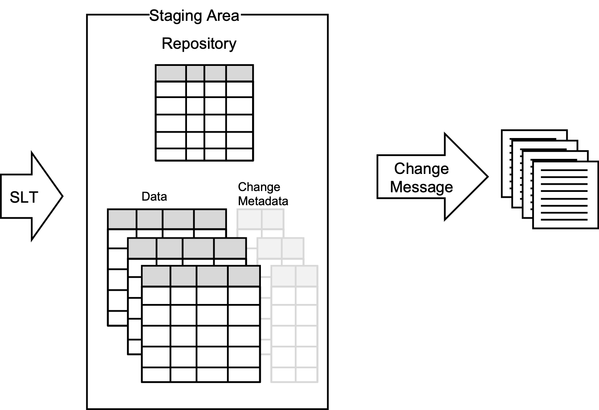
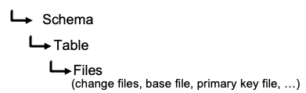
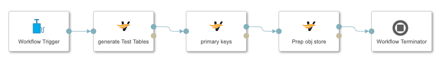
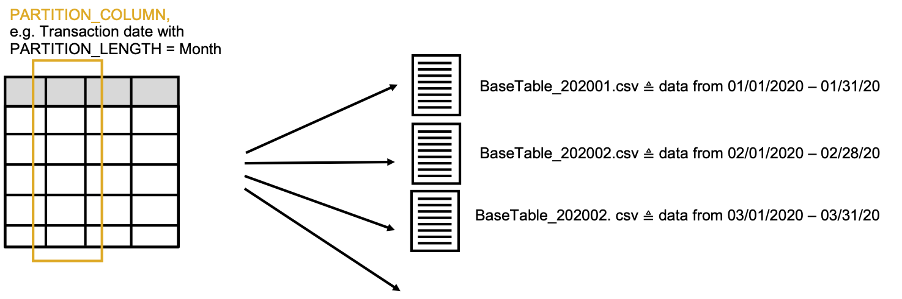
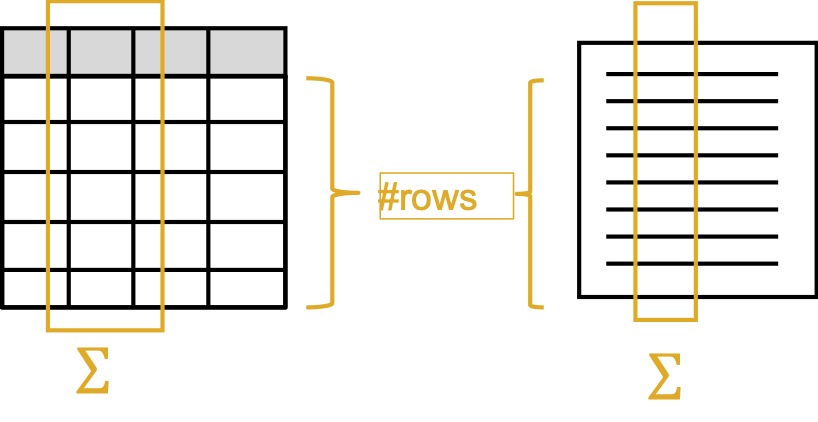
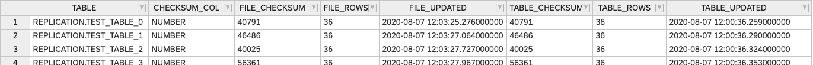

# Replication with SAP Data Intelligence

[](https://api.reuse.software/info/github.com/SAP-samples/data-intelligence-replication)

## Description 
### Introduction
Although replication comes with

* additional  effort due to setting up the processes
* additional costs for the storage
* additional latency compared to the original data

and although SAP Data Intelligence provides a growing number of connections that enables direct access to data, there are cases where replication still makes sense in particular when structure of the data sources are quite complex like for SAP ECC.

For the latter SAP Data Intelligence is addressing this need with integrating SAP Landscape Transformation (SLT) with ABAP connection types and an"SLT"-operator with SAP Data Intelligence Release 3.0. There is a very instructive blog ABAP Integration – Replicating tables into SAP Data Hub via SAP LT Replication Server written by Britta Thoelking that outlines the setup.   Admittedly this is a first release and there are still some features missing. Especially when the SLT-pipeline breaks you have to restart the process from the very beginning to ensure that no data is been lost. Due to the importance of this feature it has been decided to redesign the whole process to provide a service that is finally

* fully resilient,
* runs parallel with numerous tables to replicate with
* high performance.

The first release of the new replication service is planned for SAP Data Intelligence 3.2 (Q1 2021).

For the time being a couple of customers asked for an intermediate solution that provides the basic features of the coming solution, explicitly the resilience and the parallelisation of a couple of table replications instead of only having 1 pipeline for each replication.

In the following I propose a replication service based on SLT replicating to an additional "staging area" using a HANA database and then a Data Intelligence pipeline picking the records and storing them to an object store. For ensuring that this replication process runs as intended I provide also "test table"- generation pipelines and "consistency"-check pipelines.



### Setup
#### Additional Change Metadata

The staging table needs in addition to the table data also information about the changes. That means that the SLT script has to be adjusted that 2 additional columns are populated:

DIREPL_UPDATED with a timestamp of the change and
DIREPL_TYPE with the type of change Insert, Update, Delete.

Furthermore the replication process needs 2 more columns:

DIREPL_PID with the identifier of the process
DIREPL_STATUS carrying the status Wait, Blocked and Complete.

If you have already tables that you want to replicate then you can change the table with the HANA SQL statement:

```
ALTER TABLE <table_name> ADD (DIREPL_UPDATED TIMESTAMP, DIREPL_TYPE NVARCHAR(1), DIREPL_STATUS NVARCHAR(1), DIREPL_PID BIGINT)
```

#### Test Tables

For testing purpose I have created a pipeline that creates a specified number of tables with specified number of columns. The structure of the test columns are quite simple with 2 columns of data type BIGINT (INDEX, NUMBER) and 1 column of data type DATE (DATE).


The test tables are all added to a specified table repository.

There are also pipelines that inserts and updates the test tables and can be used for creating test scenarios including a reset after a wilful crashes/stopping of the replication pipeline.

Pipeline:

* **GenerateTestTables**
* **UpdateTestTables**
* **InsertTestTables**


#### Object Store Structure

It is been assumed that the best  way to structure the replicated data is to mirror the structure in the database: SCHEMA - TABLE.



All files concerning the replication of each table including the base-file/target-file (mirrored table), the change-files for the updates and deletes, the file containing the primary keys and later maybe the partitioned files are collected under the folder of the table name.

The folder-structure is created automatically with the first replication. But to ensure that the base-file has only one header you can run the "Prep Object Store" pipeline first that creates the file structure for all tables in a repository and creates all base files with the header only. The sequence of the csv-file is alphabetically to enable an easy append of table-inserts because databases mostly have no column order.

**Pipeline: PrepObjectStore**

#### Primary Key Replication

For merging the change-files with the base-file into a new base-file the primary keys are necessary. To enable a merging process independently of a connection to HANA  the primary keys are stored as a 1-row csv-file to the table-folder by running the pipeline "Get Primary Keys".

**Pipeline: GetPrimaryKeys** 

#### Batch Process for the  Setup

SAP Data Intelligence provides a simple operator that allows to run separate pipelines in a batch mode by using the "Pipeline"-operator with the "Workflow Trigger" and "Workflow Terminator".



**Pipeline: SetupReplication**

### Replication Pipeline

The central replication pipeline is quite straightforward and is using a couple of sql-statements for blocking, selecting and updating (->status: complete) the records that needs to be replicated. All these statements are generated in separate Custom Python operators and could easily be adjusted:

* Repl_block
* Repl_select
* Repl_complete

The conversion to the csv-format is done in another Custom Python operator: "table to csv", where you can set some parameters:

* Boolean: Dropping the header, when appending the data or not.
* Boolean: Only the header, when only run for preparation only
* List of columns to drop, e,g, the additional management columns like DIREPL_STATUS, DIREPL_PID that might not necessary.


The replication pipeline is iterating through the repository table and checks each table for changes. In case there are changes they are replicated either as "append" to the base-file or as separate change-file. The name of the change-file is composed out of the table-name and the "DIREPL_PID" number - timestamp when the records had been blocked. The only reason for using the DIREPL_PID concept is to create link between records and a replication process. This would enable also a parallelisation by starting several processes.

The pipeline could be run as an infinite loop or scheduled. When scheduled it would terminate when no changes in the table of the used repository has been found. In case of scheduling and if the previous replication pipeline is still running the usage of "DIREPL_PID"-concept of blocking prevents any mess.

As a best practise I would recommend to configure the replication pipeline and save them as:

* INSERT-replication
	* parameter "repl_block"-operator: 'I'  for DIREPL_TYPE
	* parameter: Write File: append
* UPDATE-replication
	* parameter "repl_block"-operator: 'UD'  for DIREPL_TYPE
	* parameter: Write File: create

#### DELETE Case

When replicating from ABAP via SLT there are 2 "DELETE cases. 

1. "Hard Delete" - record is actually deleted
2. "Soft Delete" - record is archived and marked as deleted. 

For a "hard"-delete it has to be ensured that the record is not genuinely deleted from the HANA table but marked with "D" in the DIREPL_TYPE field. That enables the replication process to delete the record from the csv-file. Once the record has been replicated and marked in the DIREPL_STATUS field as "C"ompleted, the records can finally be deleted. It is not done automatically after the replication process and is left for a separate run to cleanse the data from all "completed" records. If is not possible to adjust the SLT-script a table trigger could be implemented.

A "soft"-delete is ignored by the SLT-process unless it is intended to pass this information. This would mean an additional DIREPL_TYPE "A"rchived has to be processed. Currently this case is not been implemented and will be left for a customer project who actually needs it. The effort might be rather minor. 

**Pipeline:**

* **InsertReplication (Github)**
* **UpdateReplication (Github)**

### Merging Change Files

If the csv-file is not only used for archiving purpose but might be consumed by other applications, e.g. data science or advanced analytics the, a merge of all the change-files into the base-file is necessary. The usage of the original table and of the target csv-file defines a reasonable period when the merge-process should be scheduled. It has to be considered that the merge-process is quite time consuming for big tables because the whole table has to be loaded and saved. Thus some pre-thoughts are always a good investment.

To avoid that appending new records while merging change-files leads to data loss, all replication pipelines should be stopped when the merging happens.

After the merging has been completed and saved securely back to the object store all change-files are removed and the number of rows and a checksum of the table specific- "checksum"-column is stored in the repository.

**Pipeline: MergeFiles**

#### Thoughts on Partitioning

For reducing the time of the merging process the base-file could be split into several files according to a "partition"-column. This "partition"- column should have a rough uniform metric that reflects where the update mostly happens or speaking with an example: "TRANSACTION_DATE".  The values of this column grows most likely over time and the updates might occur more probable to the more recent records. Having the data separated e.g. in monthly or weekly transaction-date-buckets would increase the performance of merging the files dramatically.



This idea has not been implemented yet. The following changes needs to be done:

* Adding an additional column to the repository that specifies the "PARTITION_COLUMN" and "PARTITION_LENGTH"
* Adjusting the "table_csv"-operator for separating the records into partition-buckets
* Adding an additional operator that receives the "change-buckets" and dispatches the writing instructions: create bucket change-files or  append to the right partition base-file.

This is supposedly a 3-days development effort.

### Consistency Validation

As already mentioned in the previous section there is a checksum calculated that gives a good indication if the replication has been correct so far.

2 parameter are used to validate the consistency of the source table and the final csv-file

* Number of rows
* checksum of a specified column

For comparison there is a pipeline that calls an sql statement for getting the same data for all tables of a repository and updates the corresponding fields.



The information which column should be used for calculating the checksum can be entered in the repository. 



**Pipeline: TableProfile**

### Performance

The general performance of this replication process is quite fast because there is only one table read and the data is written to the object store only with some minor data processing in-between by using the pandas library.

If the merging time is considered as well the whole process takes much more time and the question rises why not dump the whole table repeatedly instead of merging the changes. 


The main reason is that the staging table are cleansed periodically and therefore a dump is not possible. 

When using a partition the whole process could be immensely accelerated depending how granular the splitting is chosen. Data Scientist for example can easily choose the files and concatenate them on-the-fly when starting their analytics. 

### Conclusion

This replication process implemented on SAP Data Intelligence shows how easy it is to implement a solution that crosses data sources without immersing into the respective technical intricacies. You can easily adjust the components or add new process steps. The whole project has been done for 2 PoCs and is a summary of the requirements we faced there. 

Please let me know if you like to use it and tell me about your challenges and additional requirements.

## Requirements
SAP Data Intelligence Release >3.0 

## Downloads and Installation
All operators and pipelines are packed as solution that can be dowloaded from [./solution](./solution). 

## Known Issues
There are currently no know issues. 

## How to obtain support
This is an example code without any commitment for getting support. Nonetheless you could create an issue in Github if you have any or for your questions . 

## Contributing
Due to fact that this might be an interim solution for the next 6 Months there is no further development planned. If there are ideas or contributions that might be of interest for others then please let me know. We then can figure out how to incorporate them. 

## To-Do
Any additions will be triggered by specific customer requests. There is no roadmap in place. See previous section. 

## Licence
Copyright (c) 2020 SAP SE or an SAP affiliate company. All rights reserved. This project is licensed under the Apache Software License, version 2.0 except as noted otherwise in the [LICENSE](LICENSES/Apache-2.0.txt) file.
