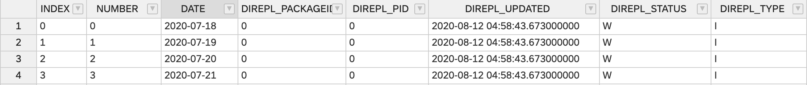
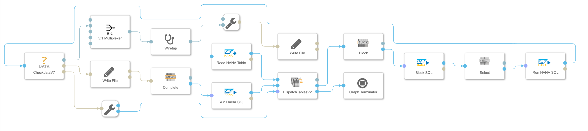
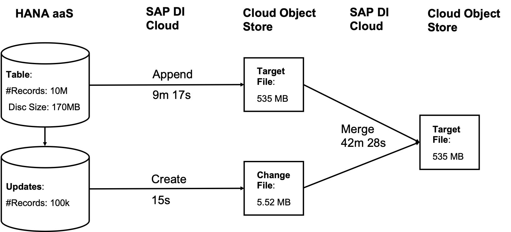

# Replication with SAP Data Intelligence

[](https://api.reuse.software/info/github.com/SAP-samples/data-intelligence-replication)

## Description

### Introduction

Although replication comes with

* additional  effort due to setting up the processes
* additional costs for the storage
* additional latency compared to the original data

and although SAP Data Intelligence provides a growing number of connections that enables direct access to data, there are cases where replication still makes sense in particular when structure of the data sources are quite complex like for SAP ECC.

For the latter SAP Data Intelligence is addressing this need with integrating SAP Landscape Transformation (SLT) with ABAP connection types and an"SLT"-operator with SAP Data Intelligence Release 3.0. There is a very instructive blog ABAP Integration – Replicating tables into SAP Data Hub via SAP LT Replication Server written by Britta Thoelking that outlines the setup.   Admittedly this is a first release and there are still some features missing. Especially when the SLT-pipeline breaks you have to restart the process from the very beginning to ensure that no data is been lost. Due to the importance of this feature it has been decided to redesign the whole process to provide a service that is finally

* fully resilient,
* runs parallel with numerous tables to replicate with
* high performance.

The first release of the new replication service is planned for SAP Data Intelligence 3.2 (Q4 2021).

For the time being a couple of customers asked for an intermediate solution that provides the basic features of the coming solution, explicitly the resilience and the parallelisation of a couple of table replications instead of only having 1 pipeline for each replication.

In the following I propose a replication service based on SLT replicating to an additional "staging area" using a HANA database and then a Data Intelligence pipeline picking the records and storing them to an object store. For ensuring that this replication process runs as intended I provide also "test table"- generation pipelines and "consistency"-check pipelines.

![graph](./images/process.png


During the last Months working with customers using the solution it became clear that it only needs to replicate the changes in a JSON format. This simplifies a lot the original solution. For reducing my  maintenance of the solution I will remove all parts that are not essential and keep only the

* Test Table Generation pipeline
* Replication pipeline

### Setup

#### Additional Change Metadata

The staging table needs in addition to the table data also information about the changes. That means that the SLT script has to be adjusted that 2 additional columns are populated:

DIREPL_UPDATED with a timestamp of the change and
DIREPL_TYPE with the type of change Insert, Update, Delete.

Furthermore the replication process needs 2 more columns:

DIREPL_PID with the identifier of the process
DIREPL_STATUS carrying the status Wait, Blocked and Complete.

If you have already tables that you want to replicate then you can change the table with the HANA SQL statement:

```
ALTER TABLE <table_name> ADD (DIREPL_UPDATED TIMESTAMP, DIREPL_TYPE NVARCHAR(1), DIREPL_STATUS NVARCHAR(1), DIREPL_PID BIGINT)
```

#### Test Tables

For testing purpose I have created a pipeline that creates a specified number of tables with specified number of columns. The structure of the test columns are quite simple with 2 columns of data type BIGINT (INDEX, NUMBER) and 1 column of data type DATE (DATE).



The test tables are all added to a specified table repository.

Pipeline:

* **GenerateTestTables**


#### Object Store Structure

The folder structure of the target object can be setup using the Placeholder-patterns of the Write-File operator. Because a file-hander cannot be shared among separate pipelines the append mode can only be used for each pipeline-file pair. I recommend to write separate files for all changes.

#### Table repository

The Table repository is a simple table that has only one column containing all the tables that should be replicated. You could have multiple table repositories. The repository is passed to the replciation pipeline

SQL code create table:

```
CREATE COLUMN TABLE "REPLICATION"."TABLE_REPOS"(
	"TABLE_NAME" NVARCHAR(100),
	PRIMARY KEY (
		"TABLE_NAME"
	)
)
```


### Replication Pipeline

The central replication pipeline is quite straightforward and is using a couple of sql-statements for blocking, selecting and updating (->status: complete) the records that needs to be replicated. All these statements are generated in separate Custom Python operators and could easily be adjusted:

* di_replication.block
* di_replication.selectdata
* di_replication.complete

In addition to these there are two other custom operators

* di_replication.dispatch_tables
* di_replication.checkdataV7



#### dispatch_tables
This operator manages the loop running over all tables of the table repository.

* Configuration mode
	* F : For loop, runs over all tables only once
	* C : Conditional, breaks when there were no changes for all tables
	* R : Removes the table name from the table loop. When all tables have been removed the pipeline terminates
	* I : There is no termination criteria. The pipeline runs until it is stopped externally
* Outport
	* log : Sending separately the log data as string
	* trigger: It sends iteratively  table-names to the ensuing replication pipeline.
	* limit: Once the abort criteria is met it sends a message to terminate the pipeline
* Inport
	* tables: Initialises the replication by sending all the table names to loop
	* data: Data has been successfully replicated
	* nodata: no data has been replicated within this loop step.


#### block

di_replication.block is the only operator of the SQL-producing operators that hat configuration parameters.

* Configuration package_size - Defines the size of the package/batches of data that should be replicated within one iteration step. Tests have shown that package sizes between 1k and 1m are reasonably. The data type is a string although it is internally cast to an integer number. The reason is to enable this parameter for being used as start parameter: ${package_size}.

In a previous release there has been an additional configuration parameter: type that acted as a filter on the 'DIREPL_TYPE'. The idea when storing 'Insert' data and 'Update/Delete'-data separately you would have already a kind of 'realtime' data with the 'Insert'-file provided that you only have rare data updates. But it was not wanted to be used by any customer and rather add complexity. For a non-standard solution simplicity is vital as I learnt.


#### checkdataV7

This operator does the essential transformation before sending the data to the object store. It also tests if there is data at all to be replicated. This is the place to add additional custom code or replace the operator at all to create your own output format.

* Configuration Codec: List of codecs to be used for decode byte-code
* Outport
	* log : Sending separately the log data as string
	* output : Transformed data ready to be stored in the object stored
	* nodata : There is no data for being replicated

#### Write File operator

For saving the data the parameter 'Path mode: Static with placeholders' can be used to setup an order, e.g. /<header:table_name>/<header:table_name>_<date>_<time>_<header:pid>.json. This stores all changes of a table into folder '<table_name>' with the nameing convention <table_name>_<date>_<transaction pid>.json. In case of a lot of small data you might also need the 'append'-mode instead of the 'create'-mode. But please keep in mind that object stores might not handle appending data to the same object but by different pipelines. At least my tests failed.


#### DELETE Case

When replicating from ABAP via SLT there are 2 "DELETE cases. 

1. "Hard Delete" - record is actually deleted
2. "Soft Delete" - record is archived and marked as deleted. 

For a "hard"-delete it has to be ensured that the record is not genuinely deleted from the HANA table but marked with "D" in the DIREPL_TYPE field. That enables the replication process to delete the record from the csv-file. Once the record has been replicated and marked in the DIREPL_STATUS field as "C"ompleted, the records can finally be deleted. It is not done automatically after the replication process and is left for a separate run to cleanse the data from all "completed" records. If is not possible to adjust the SLT-script a table trigger could be implemented.

A "soft"-delete is ignored by the SLT-process unless it is intended to pass this information. This would mean an additional DIREPL_TYPE "A"rchived has to be processed. Currently this case is not been implemented and will be left for a customer project who actually needs it. The effort might be rather minor. 


### Performance

The general performance of this replication process is quite fast because there is only one table read and the data is written to the object store only with some minor data processing in-between by using the pandas library.

If the merging time is considered as well the whole process takes much more time and the question rises why not dump the whole table repeatedly instead of merging the changes. 



The main reason is that the staging table are cleansed periodically and therefore a dump is not possible. 


### Conclusion

This replication process implemented on SAP Data Intelligence shows how easy it is to implement a solution that crosses data sources without immersing into the respective technical intricacies. You can easily adjust the components or add new process steps. The whole project has been done for 2 PoCs and is a summary of the requirements we faced there. 

Please let me know if you like to use it and tell me about your challenges and additional requirements.

## Requirements
SAP Data Intelligence Release >3.0

## Downloads and Installation
All operators and pipelines are packed as solution that can be dowloaded from [./solution](./solution).

## Known Issues
There are currently no know issues.

## How to obtain support
This is an example code without any commitment for getting support. Nonetheless you could create an issue in Github if you have any or for your questions .

## Contributing
Due to fact that this might be an interim solution for the next 6 Months there is no further development planned. If there are ideas or contributions that might be of interest for others then please let me know. We then can figure out how to incorporate them.

## To-Do
Any additions will be triggered by specific customer requests. There is no roadmap in place. See previous section.

## Licence
Copyright (c) 2020 SAP SE or an SAP affiliate company. All rights reserved. This project is licensed under the Apache Software License, version 2.0 except as noted otherwise in the [LICENSE](LICENSES/Apache-2.0.txt) file.
